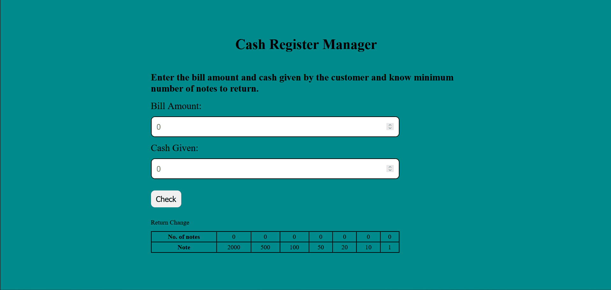

# neoG Camp - Cash Register Manager

Cash register manager calculates how the amount can be returned to the customer in minimum number of notes possible.

## Table of contents

- [Overview](#overview)
  - [Screenshot](#screenshot)
  - [Links](#links)
- [My process](#my-process)
  - [Built with](#built-with)
  - [What I learned](#what-i-learned)
- [Author](#author)

## Overview

### Screenshot



### Links

- [View live](https://calculate-change.netlify.app/)

## My process

### Built with

- Semantic HTML5 markup
- [Sass](https://sass-lang.com/) - CSS extension language
- CSS Flexbox
- Vanilla JavaScript

### What I learned

In this project, I learned about the logic which is used in this project.

Firstly, the amount to be returned is calculated

```js
const amountToBeReturn = cashGiven - billAmount;
```

After that, the availabe note values are stored inside an array and to get the number of notes we have to loop over it.

So, the required number of notes is calculated as

```js
const notes = [2000, 500, 100, 50, 20, 10, 1];

for (let i = 0; i < notes.length; i++) {
  // this will give you the number of notes for that value

  let numberOfNote = Math.trunc(amountToBeReturn) / notes[i];

  // to calculate the remaining value we need the remainder when divided by the same note value and amount to be returned becomes the remainder

  amountToBeReturn %= notes[i];
}
```

This is how we calculate the number of notes.

## Author

- Twitter - [@junaidshaikh_js](https://twitter.com/junaidshaikh_js)
- Linkedin - [@junaidshaikhjs](https://www.linkedin.com/in/junaidshaikhjs/)
